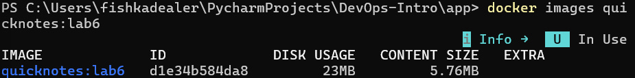
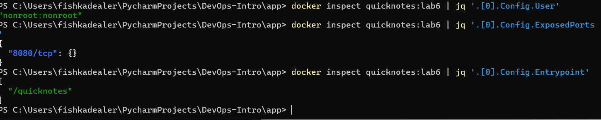
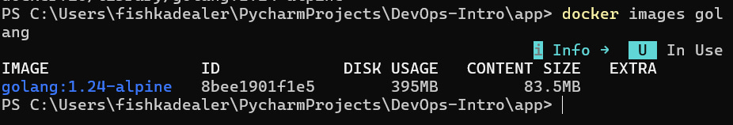
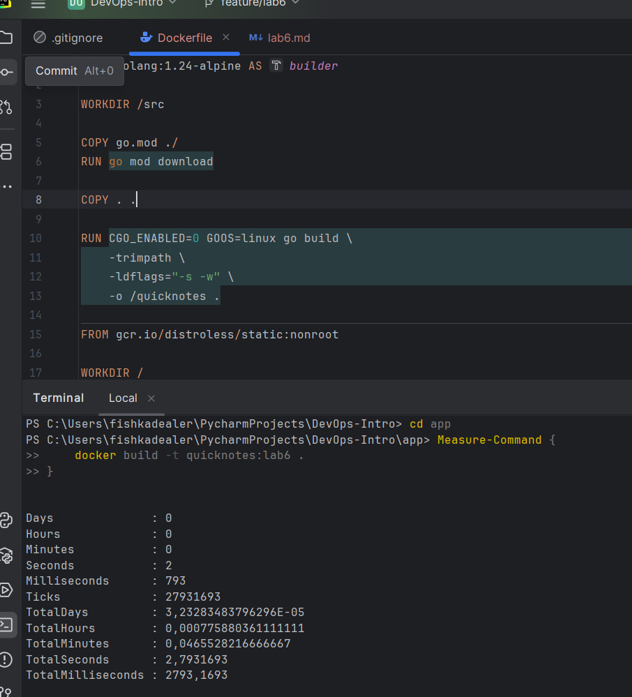
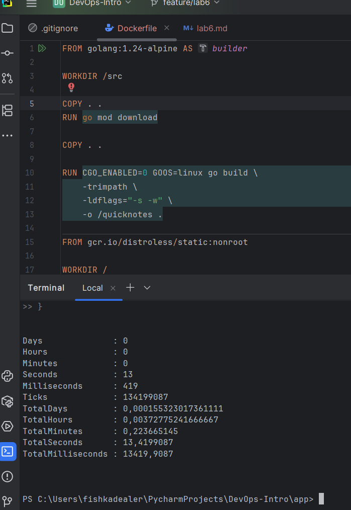
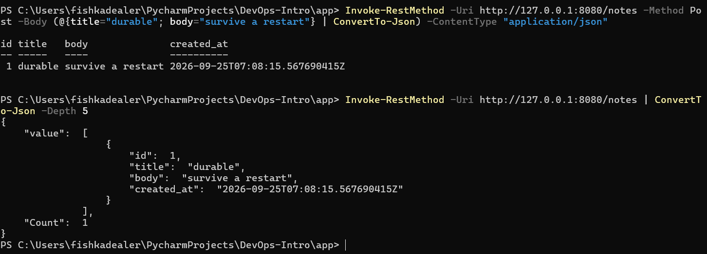
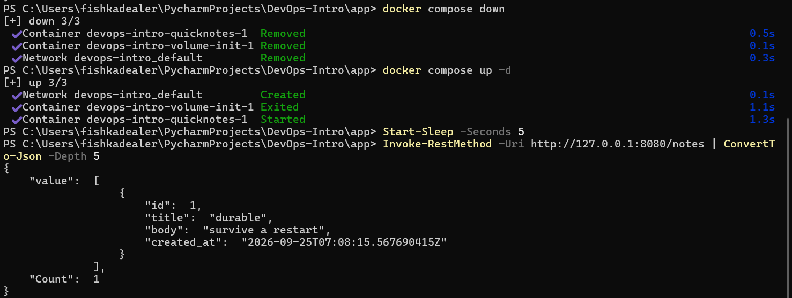
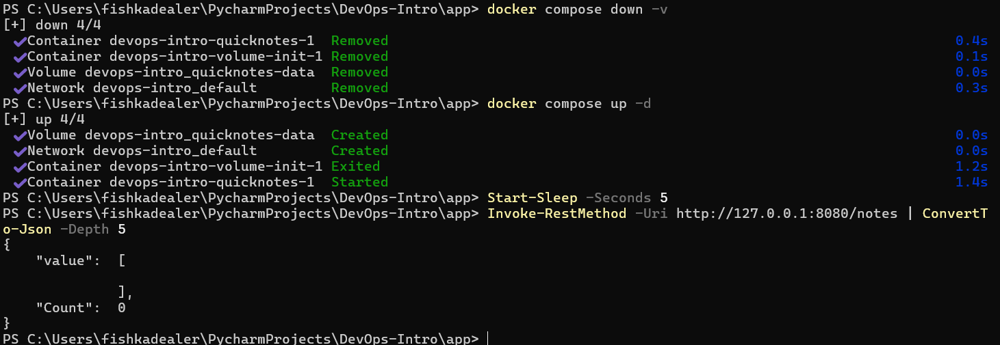

# Lab 6 Solution

## Task 1

### 1. Dockerfile
```
FROM golang:1.24-alpine AS builder

WORKDIR /src

COPY go.mod ./
RUN go mod download

COPY . .

RUN CGO_ENABLED=0 GOOS=linux go build \
    -trimpath \
    -ldflags="-s -w" \
    -o /quicknotes .

RUN cat > /tmp/healthcheck.go <<'EOF'
package main

import (
	"net/http"
	"os"
	"time"
)

func main() {
	client := http.Client{
		Timeout: 2 * time.Second,
	}

	resp, err := client.Get("http://127.0.0.1:8080/health")
	if err != nil {
		os.Exit(1)
	}

	defer resp.Body.Close()

	if resp.StatusCode != http.StatusOK {
		os.Exit(1)
	}
}
EOF

RUN CGO_ENABLED=0 GOOS=linux go build \
    -trimpath \
    -ldflags="-s -w" \
    -o /healthcheck /tmp/healthcheck.go


FROM gcr.io/distroless/static:nonroot

WORKDIR /

COPY --from=builder /quicknotes /quicknotes
COPY --from=builder /healthcheck /healthcheck

EXPOSE 8080

USER nonroot:nonroot

ENTRYPOINT ["/quicknotes"]
```

### 2. Output of ```docker images quicknotes:lab6 output```


### 3. Output of ```docker inspect quicknotes:lab6 | jq '.[0].Config'```


### 4. The ```golang:1.24-alpine``` (or whatever you used) base image size for comparison


### 5. Questions

#### a) Why does layer-order matter? Show before/after rebuild times for two strategies: ```COPY . . && go mod download && go build``` vs ```COPY go.mod go.sum ./ && go mod download && COPY . . && go build```

In the second case, Docker will be able to use the cache, provided, of course, that the specified files have not changed. In the first case, any change increases the likelihood that Docker will need to load the dependencies again.


#### b) Why is ```CGO_ENABLED=0```?

Because such ```CGO_ENABLED``` creates a statically linked Go binary.

And distroless/static does not contain the standard dynamic linker and the system userspace required for a dynamic binary.

#### c) What is ```gcr.io/distroless/static:nonroot```?

gcr.io/distroless/static:nonroot is a minimal container image designed to run statically compiled applications.

It contains the minimal files required by a static application

It does not provide common tools such as:

/bin/sh
bash
apt
apk
package managers
normal debugging utilities

The nonroot variant configures the container to run as an unprivileged user rather than root.

#### d) -ldflags="-s -w" and -trimpath
The build command uses:
-ldflags="-s -w"
-s removes the symbol table from the executable.
-w removes DWARF debugging information.
Together they reduce the size of the resulting Go binary, which helps keep the final container image below the 25 MB requirement.
The build also uses:
-trimpath
This removes local filesystem paths from the compiled binary and build information. 


## Task 2

### 1. compose.yml
```
services:
  volume-init:
    image: alpine:3.20
    user: "0:0"
    volumes:
      - quicknotes-data:/data
    command: >
      sh -c "[ -s /data/notes.json ] || echo '[]' > /data/notes.json &&
                   chown 65532:65532 /data/notes.json &&
                   chmod 600 /data/notes.json &&
                   chown 65532:65532 /data"
    restart: "no"

  quicknotes:
    build:
      context: ./app
      dockerfile: Dockerfile
    image: quicknotes:lab6
    ports:
      - "8080:8080"
    volumes:
      - quicknotes-data:/data
    environment:
      ADDR: ":8080"
      DATA_PATH: "/data/notes.json"
      SEED_PATH: "/data/notes.json"
    depends_on:
      volume-init:
        condition: service_completed_successfully
    restart: unless-stopped

volumes:
  quicknotes-data:
```

### 2. The 3-step persistence test output




### 3. Questions
#### e) The distroless image does not contain a shell. How do you check its functionality?

The usual health check using a shell, for example:

```
healthcheck:
  test: ["CMD-SHELL", "curl http://localhost:8080/health"]
```

does not work with the distroless image, since the image does not contain a shell.

#### f) Why are volumes: [quicknotes-data:/data] not deleted when running `docker compose down`?

quicknotes-data is a named Docker volume.

The volume exists independently of the container that uses it. When the container is deleted, the data stored in the named volume is not automatically removed.

Therefore:

```docker compose down```

deletes the Compose containers and network, but usually leaves the named volumes.

When the project is run again, the same named volume is mounted to /data, so the notes.json file is still available.

The volume is explicitly deleted when using the command:

```docker compose down -v```

The -v option indicates that the project volumes should be deleted.

#### g) depends_on without a condition: service_healthy

Simple dependency:

```
depends_on:
  - quicknotes
```

defines the order in which services are started. This does not mean that the application is ready to accept requests. 
The container may be in the “running” state while the application inside it is still initializing. 
This may lead to a race condition: When a service health check is available, Compose can use:

```
depends_on:
  quicknotes:
    condition: service_healthy
```